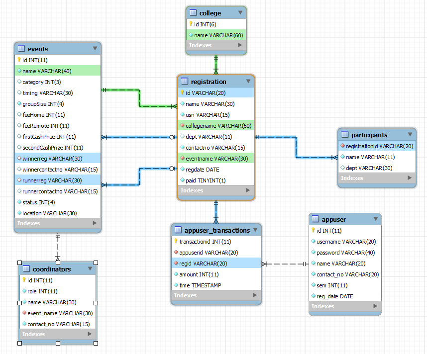
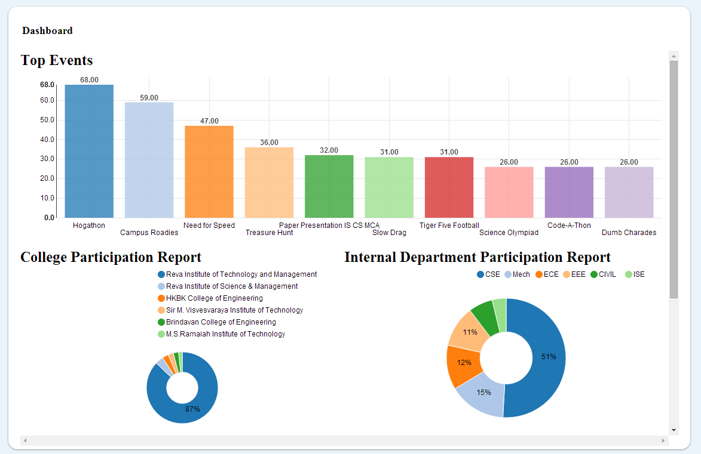
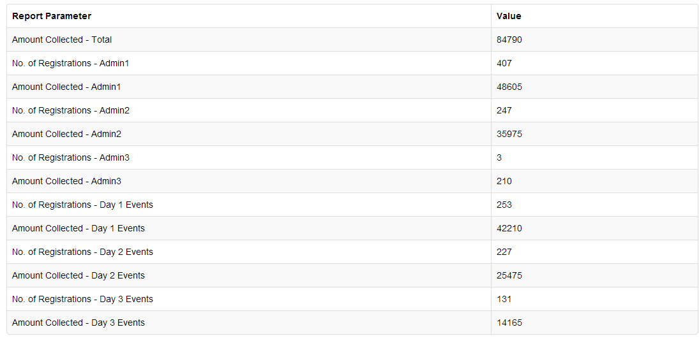

Fest Management System
======================

This is a web-based tool to effectively manage registrations, events and transactions in a college-level fest. 

It can either be deployed completely online or offline across a LAN with multiple workstation users registering users, printing out the receipt and the paydesk admin users confirming the transaction.

It has a clean UI and the reports section can easily be extended to meet any ad-hoc reporting needs of the event organizers or conveners. 

Table structure :-

Dashboard :-

Basic Reports :-

Instructions
============

To deploy this application, you need to download WAMP Server or XAMPP server and run Apache and Mysql from the server's control panel.

Place the src folder under the www folder in wamp or the htdocs folder in xampp.

Go to phpMyAdmin by accessing localhost/phpmyadmin or find it from your server's control panel.
Create a database called fms and import one of the sql files provided in the docs folder. The full example provides existing entries to test out the application. For a fresh clean database with a single sample entry, import the structure.sql file.

You are required to navigate to the db.php file and provide the appropriate mysql password in place of the 'mysql' string.

Admin privileges such as confirming transactions and refund features are hardcoded to be accessible by only users with username admin1/admin2/admin3.

If you have imported the structure.sql file, you need to setup your event information details and co-ordinator details from phpMyAdmin. Then you need to create your admin users by using the helper files provided inside the helpers directory.

Info
====

Default login - admin3/password

Most of the input strings are cleaned of any special characters to prevent basic SQL injection.

Features
========

* Focus on registrations, registration reports and recording transactions.
* Refund option deletes the transaction.
* Transaction summaries can be drawn user-wise between specific timestamps.
* Search registration by id,name,usn or contact no.
* Print support for lists which can be generated according to college or event.
* Co-ordinators and winners are managed event-wise.
* Additional participants for each team can be recorded to keep track of department-level activity.